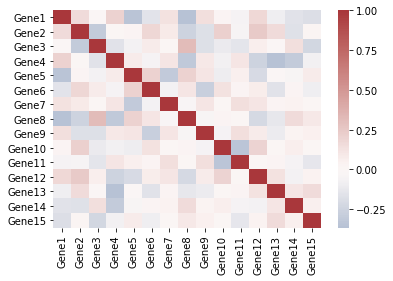

# Seaborn绘制相关性热图

## 1. 准备数据


```python
import pandas as pd
import numpy as np
import seaborn as sns

df = pd.DataFrame(np.random.randint(0,10,(50,15)), columns=["Gene%s" % i for i in range(1,16)])

df
```


<div>
<style scoped>
    .dataframe tbody tr th:only-of-type {
        vertical-align: middle;
    }

    .dataframe tbody tr th {
        vertical-align: top;
    }

    .dataframe thead th {
        text-align: right;
    }
</style>
<table border="1" class="dataframe">
  <thead>
    <tr style="text-align: right;">
      <th></th>
      <th>Gene1</th>
      <th>Gene2</th>
      <th>Gene3</th>
      <th>Gene4</th>
      <th>Gene5</th>
      <th>Gene6</th>
      <th>Gene7</th>
      <th>Gene8</th>
      <th>Gene9</th>
      <th>Gene10</th>
      <th>Gene11</th>
      <th>Gene12</th>
      <th>Gene13</th>
      <th>Gene14</th>
      <th>Gene15</th>
    </tr>
  </thead>
  <tbody>
    <tr>
      <th>0</th>
      <td>7</td>
      <td>5</td>
      <td>3</td>
      <td>8</td>
      <td>1</td>
      <td>4</td>
      <td>8</td>
      <td>4</td>
      <td>6</td>
      <td>0</td>
      <td>9</td>
      <td>8</td>
      <td>5</td>
      <td>1</td>
      <td>3</td>
    </tr>
    <tr>
      <th>1</th>
      <td>6</td>
      <td>8</td>
      <td>3</td>
      <td>9</td>
      <td>2</td>
      <td>2</td>
      <td>3</td>
      <td>3</td>
      <td>4</td>
      <td>8</td>
      <td>7</td>
      <td>4</td>
      <td>9</td>
      <td>8</td>
      <td>2</td>
    </tr>
    <tr>
      <th>2</th>
      <td>6</td>
      <td>9</td>
      <td>2</td>
      <td>9</td>
      <td>3</td>
      <td>6</td>
      <td>4</td>
      <td>1</td>
      <td>5</td>
      <td>2</td>
      <td>8</td>
      <td>9</td>
      <td>2</td>
      <td>3</td>
      <td>4</td>
    </tr>
    <tr>
      <th>3</th>
      <td>4</td>
      <td>9</td>
      <td>6</td>
      <td>7</td>
      <td>4</td>
      <td>8</td>
      <td>3</td>
      <td>3</td>
      <td>3</td>
      <td>9</td>
      <td>0</td>
      <td>8</td>
      <td>2</td>
      <td>3</td>
      <td>0</td>
    </tr>
    <tr>
      <th>4</th>
      <td>3</td>
      <td>5</td>
      <td>1</td>
      <td>4</td>
      <td>5</td>
      <td>6</td>
      <td>0</td>
      <td>2</td>
      <td>8</td>
      <td>5</td>
      <td>0</td>
      <td>6</td>
      <td>9</td>
      <td>0</td>
      <td>7</td>
    </tr>
    <tr>
      <th>5</th>
      <td>1</td>
      <td>8</td>
      <td>5</td>
      <td>7</td>
      <td>9</td>
      <td>4</td>
      <td>3</td>
      <td>8</td>
      <td>4</td>
      <td>6</td>
      <td>7</td>
      <td>9</td>
      <td>5</td>
      <td>4</td>
      <td>8</td>
    </tr>
    <tr>
      <th>6</th>
      <td>9</td>
      <td>5</td>
      <td>4</td>
      <td>7</td>
      <td>7</td>
      <td>6</td>
      <td>0</td>
      <td>4</td>
      <td>6</td>
      <td>8</td>
      <td>1</td>
      <td>5</td>
      <td>4</td>
      <td>9</td>
      <td>7</td>
    </tr>
    <tr>
      <th>7</th>
      <td>7</td>
      <td>7</td>
      <td>4</td>
      <td>1</td>
      <td>1</td>
      <td>8</td>
      <td>7</td>
      <td>4</td>
      <td>4</td>
      <td>9</td>
      <td>3</td>
      <td>8</td>
      <td>8</td>
      <td>9</td>
      <td>4</td>
    </tr>
    <tr>
      <th>8</th>
      <td>0</td>
      <td>5</td>
      <td>5</td>
      <td>2</td>
      <td>2</td>
      <td>4</td>
      <td>6</td>
      <td>6</td>
      <td>2</td>
      <td>2</td>
      <td>0</td>
      <td>6</td>
      <td>5</td>
      <td>8</td>
      <td>8</td>
    </tr>
    <tr>
      <th>9</th>
      <td>8</td>
      <td>5</td>
      <td>7</td>
      <td>3</td>
      <td>1</td>
      <td>6</td>
      <td>5</td>
      <td>5</td>
      <td>4</td>
      <td>2</td>
      <td>8</td>
      <td>5</td>
      <td>8</td>
      <td>5</td>
      <td>3</td>
    </tr>
    <tr>
      <th>10</th>
      <td>6</td>
      <td>2</td>
      <td>7</td>
      <td>9</td>
      <td>1</td>
      <td>3</td>
      <td>6</td>
      <td>2</td>
      <td>7</td>
      <td>7</td>
      <td>4</td>
      <td>9</td>
      <td>1</td>
      <td>4</td>
      <td>0</td>
    </tr>
    <tr>
      <th>11</th>
      <td>2</td>
      <td>5</td>
      <td>1</td>
      <td>7</td>
      <td>5</td>
      <td>1</td>
      <td>6</td>
      <td>6</td>
      <td>4</td>
      <td>8</td>
      <td>4</td>
      <td>2</td>
      <td>9</td>
      <td>6</td>
      <td>6</td>
    </tr>
    <tr>
      <th>12</th>
      <td>0</td>
      <td>8</td>
      <td>2</td>
      <td>0</td>
      <td>9</td>
      <td>9</td>
      <td>6</td>
      <td>8</td>
      <td>0</td>
      <td>5</td>
      <td>8</td>
      <td>2</td>
      <td>9</td>
      <td>7</td>
      <td>2</td>
    </tr>
    <tr>
      <th>13</th>
      <td>8</td>
      <td>7</td>
      <td>2</td>
      <td>2</td>
      <td>1</td>
      <td>8</td>
      <td>8</td>
      <td>3</td>
      <td>3</td>
      <td>4</td>
      <td>8</td>
      <td>9</td>
      <td>8</td>
      <td>2</td>
      <td>0</td>
    </tr>
    <tr>
      <th>14</th>
      <td>2</td>
      <td>8</td>
      <td>2</td>
      <td>7</td>
      <td>1</td>
      <td>7</td>
      <td>9</td>
      <td>1</td>
      <td>2</td>
      <td>9</td>
      <td>2</td>
      <td>7</td>
      <td>8</td>
      <td>9</td>
      <td>8</td>
    </tr>
    <tr>
      <th>15</th>
      <td>0</td>
      <td>0</td>
      <td>6</td>
      <td>7</td>
      <td>4</td>
      <td>6</td>
      <td>8</td>
      <td>6</td>
      <td>9</td>
      <td>4</td>
      <td>7</td>
      <td>5</td>
      <td>2</td>
      <td>2</td>
      <td>6</td>
    </tr>
    <tr>
      <th>16</th>
      <td>3</td>
      <td>6</td>
      <td>2</td>
      <td>9</td>
      <td>5</td>
      <td>7</td>
      <td>4</td>
      <td>1</td>
      <td>2</td>
      <td>4</td>
      <td>9</td>
      <td>2</td>
      <td>3</td>
      <td>2</td>
      <td>1</td>
    </tr>
    <tr>
      <th>17</th>
      <td>7</td>
      <td>5</td>
      <td>4</td>
      <td>2</td>
      <td>1</td>
      <td>1</td>
      <td>8</td>
      <td>9</td>
      <td>8</td>
      <td>7</td>
      <td>1</td>
      <td>3</td>
      <td>2</td>
      <td>1</td>
      <td>9</td>
    </tr>
    <tr>
      <th>18</th>
      <td>8</td>
      <td>7</td>
      <td>2</td>
      <td>3</td>
      <td>0</td>
      <td>6</td>
      <td>1</td>
      <td>1</td>
      <td>5</td>
      <td>7</td>
      <td>3</td>
      <td>5</td>
      <td>0</td>
      <td>9</td>
      <td>1</td>
    </tr>
    <tr>
      <th>19</th>
      <td>3</td>
      <td>8</td>
      <td>4</td>
      <td>3</td>
      <td>9</td>
      <td>9</td>
      <td>0</td>
      <td>5</td>
      <td>2</td>
      <td>4</td>
      <td>0</td>
      <td>7</td>
      <td>9</td>
      <td>1</td>
      <td>7</td>
    </tr>
    <tr>
      <th>20</th>
      <td>9</td>
      <td>6</td>
      <td>9</td>
      <td>7</td>
      <td>0</td>
      <td>1</td>
      <td>8</td>
      <td>0</td>
      <td>2</td>
      <td>0</td>
      <td>5</td>
      <td>7</td>
      <td>9</td>
      <td>3</td>
      <td>0</td>
    </tr>
    <tr>
      <th>21</th>
      <td>7</td>
      <td>7</td>
      <td>0</td>
      <td>7</td>
      <td>4</td>
      <td>0</td>
      <td>9</td>
      <td>0</td>
      <td>8</td>
      <td>2</td>
      <td>6</td>
      <td>7</td>
      <td>7</td>
      <td>9</td>
      <td>8</td>
    </tr>
    <tr>
      <th>22</th>
      <td>0</td>
      <td>2</td>
      <td>3</td>
      <td>2</td>
      <td>9</td>
      <td>3</td>
      <td>4</td>
      <td>5</td>
      <td>8</td>
      <td>1</td>
      <td>8</td>
      <td>8</td>
      <td>3</td>
      <td>5</td>
      <td>1</td>
    </tr>
    <tr>
      <th>23</th>
      <td>9</td>
      <td>9</td>
      <td>2</td>
      <td>9</td>
      <td>3</td>
      <td>9</td>
      <td>8</td>
      <td>2</td>
      <td>1</td>
      <td>9</td>
      <td>1</td>
      <td>8</td>
      <td>1</td>
      <td>0</td>
      <td>8</td>
    </tr>
    <tr>
      <th>24</th>
      <td>2</td>
      <td>3</td>
      <td>3</td>
      <td>8</td>
      <td>5</td>
      <td>5</td>
      <td>2</td>
      <td>6</td>
      <td>5</td>
      <td>1</td>
      <td>6</td>
      <td>1</td>
      <td>3</td>
      <td>6</td>
      <td>8</td>
    </tr>
    <tr>
      <th>25</th>
      <td>8</td>
      <td>2</td>
      <td>1</td>
      <td>4</td>
      <td>4</td>
      <td>0</td>
      <td>5</td>
      <td>1</td>
      <td>8</td>
      <td>6</td>
      <td>5</td>
      <td>7</td>
      <td>8</td>
      <td>7</td>
      <td>9</td>
    </tr>
    <tr>
      <th>26</th>
      <td>9</td>
      <td>9</td>
      <td>3</td>
      <td>6</td>
      <td>7</td>
      <td>6</td>
      <td>4</td>
      <td>1</td>
      <td>9</td>
      <td>1</td>
      <td>5</td>
      <td>6</td>
      <td>0</td>
      <td>7</td>
      <td>1</td>
    </tr>
    <tr>
      <th>27</th>
      <td>4</td>
      <td>7</td>
      <td>6</td>
      <td>3</td>
      <td>1</td>
      <td>8</td>
      <td>7</td>
      <td>1</td>
      <td>3</td>
      <td>5</td>
      <td>3</td>
      <td>6</td>
      <td>7</td>
      <td>3</td>
      <td>1</td>
    </tr>
    <tr>
      <th>28</th>
      <td>0</td>
      <td>7</td>
      <td>5</td>
      <td>1</td>
      <td>1</td>
      <td>6</td>
      <td>0</td>
      <td>7</td>
      <td>0</td>
      <td>2</td>
      <td>7</td>
      <td>2</td>
      <td>5</td>
      <td>7</td>
      <td>8</td>
    </tr>
    <tr>
      <th>29</th>
      <td>7</td>
      <td>2</td>
      <td>7</td>
      <td>2</td>
      <td>3</td>
      <td>4</td>
      <td>4</td>
      <td>8</td>
      <td>7</td>
      <td>8</td>
      <td>1</td>
      <td>7</td>
      <td>3</td>
      <td>8</td>
      <td>0</td>
    </tr>
    <tr>
      <th>30</th>
      <td>8</td>
      <td>3</td>
      <td>9</td>
      <td>9</td>
      <td>5</td>
      <td>9</td>
      <td>5</td>
      <td>7</td>
      <td>9</td>
      <td>5</td>
      <td>2</td>
      <td>1</td>
      <td>4</td>
      <td>7</td>
      <td>3</td>
    </tr>
    <tr>
      <th>31</th>
      <td>6</td>
      <td>4</td>
      <td>8</td>
      <td>5</td>
      <td>7</td>
      <td>7</td>
      <td>0</td>
      <td>7</td>
      <td>4</td>
      <td>5</td>
      <td>7</td>
      <td>8</td>
      <td>4</td>
      <td>5</td>
      <td>7</td>
    </tr>
    <tr>
      <th>32</th>
      <td>8</td>
      <td>4</td>
      <td>6</td>
      <td>7</td>
      <td>3</td>
      <td>0</td>
      <td>1</td>
      <td>0</td>
      <td>2</td>
      <td>4</td>
      <td>8</td>
      <td>5</td>
      <td>8</td>
      <td>0</td>
      <td>2</td>
    </tr>
    <tr>
      <th>33</th>
      <td>4</td>
      <td>3</td>
      <td>8</td>
      <td>1</td>
      <td>6</td>
      <td>9</td>
      <td>1</td>
      <td>2</td>
      <td>1</td>
      <td>4</td>
      <td>4</td>
      <td>8</td>
      <td>6</td>
      <td>7</td>
      <td>7</td>
    </tr>
    <tr>
      <th>34</th>
      <td>3</td>
      <td>7</td>
      <td>0</td>
      <td>4</td>
      <td>4</td>
      <td>0</td>
      <td>4</td>
      <td>2</td>
      <td>5</td>
      <td>9</td>
      <td>1</td>
      <td>8</td>
      <td>7</td>
      <td>3</td>
      <td>9</td>
    </tr>
    <tr>
      <th>35</th>
      <td>1</td>
      <td>1</td>
      <td>6</td>
      <td>8</td>
      <td>7</td>
      <td>9</td>
      <td>0</td>
      <td>2</td>
      <td>0</td>
      <td>1</td>
      <td>0</td>
      <td>3</td>
      <td>6</td>
      <td>7</td>
      <td>3</td>
    </tr>
    <tr>
      <th>36</th>
      <td>6</td>
      <td>0</td>
      <td>1</td>
      <td>8</td>
      <td>0</td>
      <td>3</td>
      <td>8</td>
      <td>3</td>
      <td>7</td>
      <td>0</td>
      <td>6</td>
      <td>4</td>
      <td>4</td>
      <td>9</td>
      <td>7</td>
    </tr>
    <tr>
      <th>37</th>
      <td>8</td>
      <td>3</td>
      <td>1</td>
      <td>9</td>
      <td>4</td>
      <td>4</td>
      <td>0</td>
      <td>2</td>
      <td>4</td>
      <td>1</td>
      <td>4</td>
      <td>3</td>
      <td>3</td>
      <td>2</td>
      <td>2</td>
    </tr>
    <tr>
      <th>38</th>
      <td>3</td>
      <td>1</td>
      <td>6</td>
      <td>1</td>
      <td>3</td>
      <td>3</td>
      <td>2</td>
      <td>7</td>
      <td>9</td>
      <td>2</td>
      <td>8</td>
      <td>8</td>
      <td>6</td>
      <td>6</td>
      <td>5</td>
    </tr>
    <tr>
      <th>39</th>
      <td>3</td>
      <td>6</td>
      <td>2</td>
      <td>9</td>
      <td>4</td>
      <td>1</td>
      <td>1</td>
      <td>4</td>
      <td>1</td>
      <td>6</td>
      <td>1</td>
      <td>1</td>
      <td>1</td>
      <td>0</td>
      <td>2</td>
    </tr>
    <tr>
      <th>40</th>
      <td>1</td>
      <td>1</td>
      <td>2</td>
      <td>9</td>
      <td>2</td>
      <td>5</td>
      <td>2</td>
      <td>2</td>
      <td>6</td>
      <td>5</td>
      <td>6</td>
      <td>3</td>
      <td>2</td>
      <td>4</td>
      <td>6</td>
    </tr>
    <tr>
      <th>41</th>
      <td>6</td>
      <td>5</td>
      <td>0</td>
      <td>3</td>
      <td>2</td>
      <td>5</td>
      <td>0</td>
      <td>7</td>
      <td>1</td>
      <td>3</td>
      <td>3</td>
      <td>4</td>
      <td>3</td>
      <td>6</td>
      <td>3</td>
    </tr>
    <tr>
      <th>42</th>
      <td>1</td>
      <td>1</td>
      <td>9</td>
      <td>0</td>
      <td>0</td>
      <td>4</td>
      <td>1</td>
      <td>8</td>
      <td>0</td>
      <td>5</td>
      <td>2</td>
      <td>9</td>
      <td>7</td>
      <td>8</td>
      <td>5</td>
    </tr>
    <tr>
      <th>43</th>
      <td>5</td>
      <td>0</td>
      <td>7</td>
      <td>3</td>
      <td>4</td>
      <td>0</td>
      <td>3</td>
      <td>4</td>
      <td>4</td>
      <td>7</td>
      <td>2</td>
      <td>0</td>
      <td>6</td>
      <td>8</td>
      <td>0</td>
    </tr>
    <tr>
      <th>44</th>
      <td>0</td>
      <td>5</td>
      <td>2</td>
      <td>2</td>
      <td>4</td>
      <td>9</td>
      <td>4</td>
      <td>2</td>
      <td>4</td>
      <td>7</td>
      <td>8</td>
      <td>6</td>
      <td>6</td>
      <td>9</td>
      <td>8</td>
    </tr>
    <tr>
      <th>45</th>
      <td>3</td>
      <td>6</td>
      <td>2</td>
      <td>3</td>
      <td>7</td>
      <td>0</td>
      <td>1</td>
      <td>1</td>
      <td>9</td>
      <td>0</td>
      <td>2</td>
      <td>3</td>
      <td>9</td>
      <td>5</td>
      <td>7</td>
    </tr>
    <tr>
      <th>46</th>
      <td>9</td>
      <td>2</td>
      <td>1</td>
      <td>8</td>
      <td>4</td>
      <td>7</td>
      <td>4</td>
      <td>3</td>
      <td>0</td>
      <td>4</td>
      <td>6</td>
      <td>3</td>
      <td>2</td>
      <td>0</td>
      <td>7</td>
    </tr>
    <tr>
      <th>47</th>
      <td>4</td>
      <td>6</td>
      <td>4</td>
      <td>9</td>
      <td>8</td>
      <td>5</td>
      <td>5</td>
      <td>5</td>
      <td>8</td>
      <td>0</td>
      <td>8</td>
      <td>0</td>
      <td>5</td>
      <td>3</td>
      <td>6</td>
    </tr>
    <tr>
      <th>48</th>
      <td>0</td>
      <td>1</td>
      <td>9</td>
      <td>7</td>
      <td>7</td>
      <td>6</td>
      <td>9</td>
      <td>9</td>
      <td>0</td>
      <td>1</td>
      <td>4</td>
      <td>0</td>
      <td>1</td>
      <td>9</td>
      <td>3</td>
    </tr>
    <tr>
      <th>49</th>
      <td>9</td>
      <td>6</td>
      <td>9</td>
      <td>4</td>
      <td>0</td>
      <td>0</td>
      <td>6</td>
      <td>2</td>
      <td>0</td>
      <td>0</td>
      <td>0</td>
      <td>6</td>
      <td>6</td>
      <td>5</td>
      <td>9</td>
    </tr>
  </tbody>
</table>
</div>


## 2. 画图

* 简单的热图


```python
sns.heatmap(df.corr(), center=0, cmap="vlag", linewidths=0, annot=False)

```


    <matplotlib.axes._subplots.AxesSubplot at 0x146defb0>





* 聚类热图


```python
sns.clustermap(df.corr(), center=0, cmap="vlag", linewidths=0,annot=True)
```


    <seaborn.matrix.ClusterGrid at 0x14675c70>


